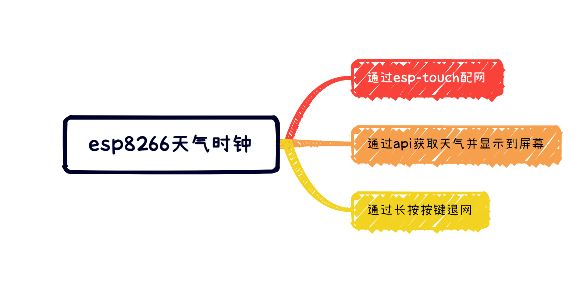
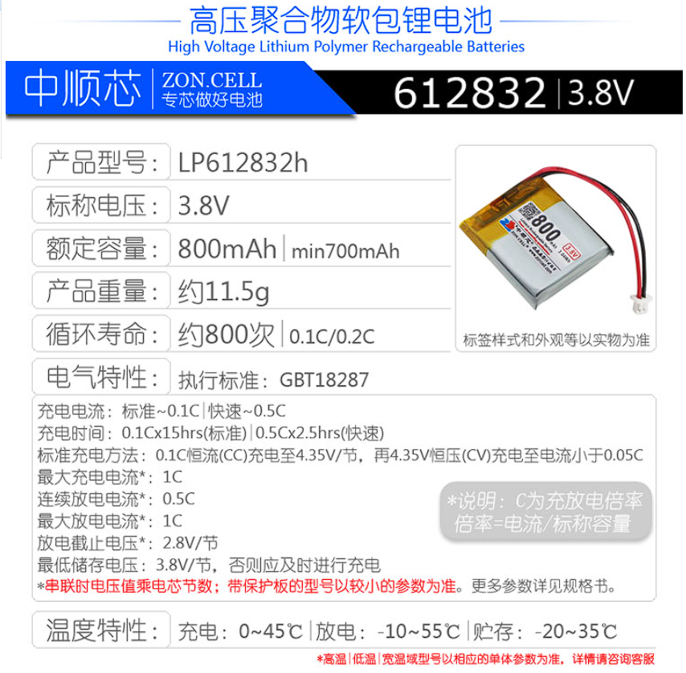
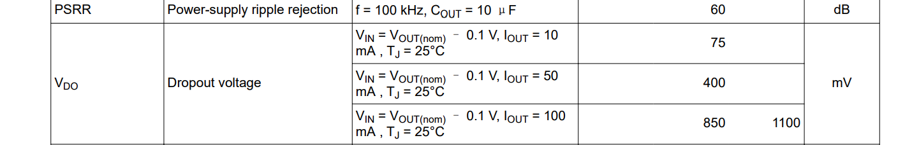

# 环境介绍

硬件部分采用Altium Designer 21开发。

软件部分采用esp-idf开发。软件开发环境可以根据乐鑫官方去构建。

# 软件功能框架

    

# 硬件框架

# 元器件选型

## 锂电池

预充电电流0.1C，快速充电电流0.5C。

    

## LDO选项及讲解
我打算使用的LDO为**tps7a20**。

本项目采用锂电池供电，锂电池的标准电压为3.7V，充满电之后的电压为4.2V，放电的保护电压为3.0V。在3.0V~4.2V这个区间，电池的电量为300毫安时。

而ESP-12F模组手册上提供的供电电压最小值为3.0V。（实际上ESP8266EX这款芯片工作电压最低位2.5V），我们这里就按照3.0V为最小供电电压设计。

在选择LDO的时候，需要考虑到输出电流，静态电流，压降，温度等方面，下面就让我来给大家剖析一下，我选择这款LDO的原因。

### (1)输出电流

锂电池供电，根据手册可以得知ESP8266-12F这款模组的峰值电流为170毫安，而LCD屏幕的电流为30毫安。本电路设计中，主要耗电为这两个器件。于是我计划中选择LDO的供电电流留出了50%的余量，即为**大于300毫安**即可。

### (2)

    

